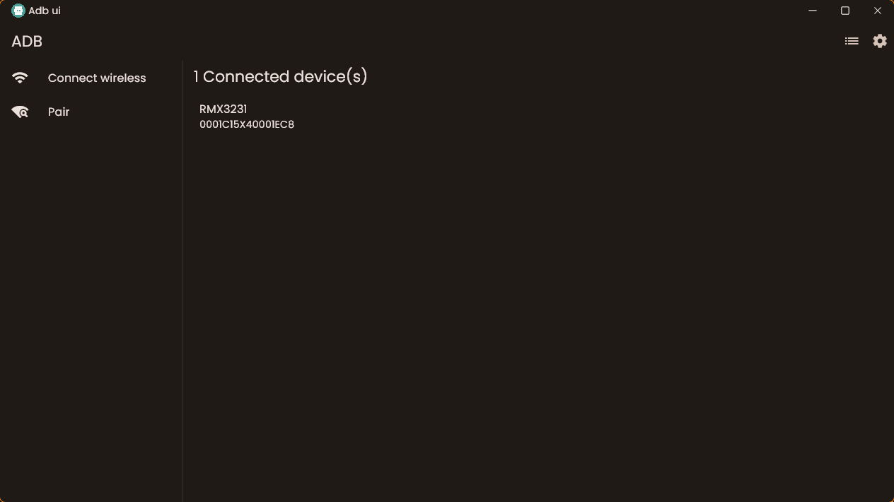
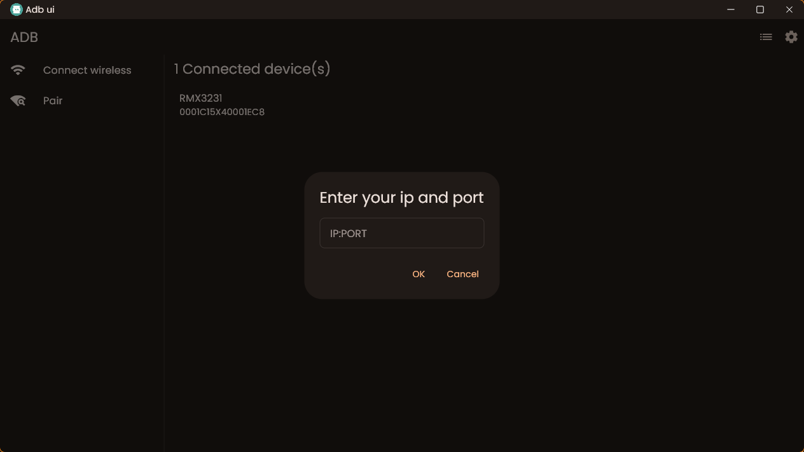
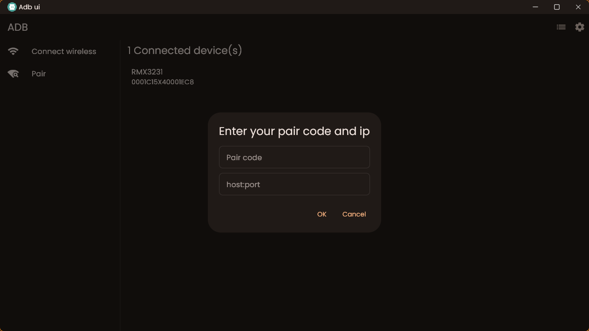
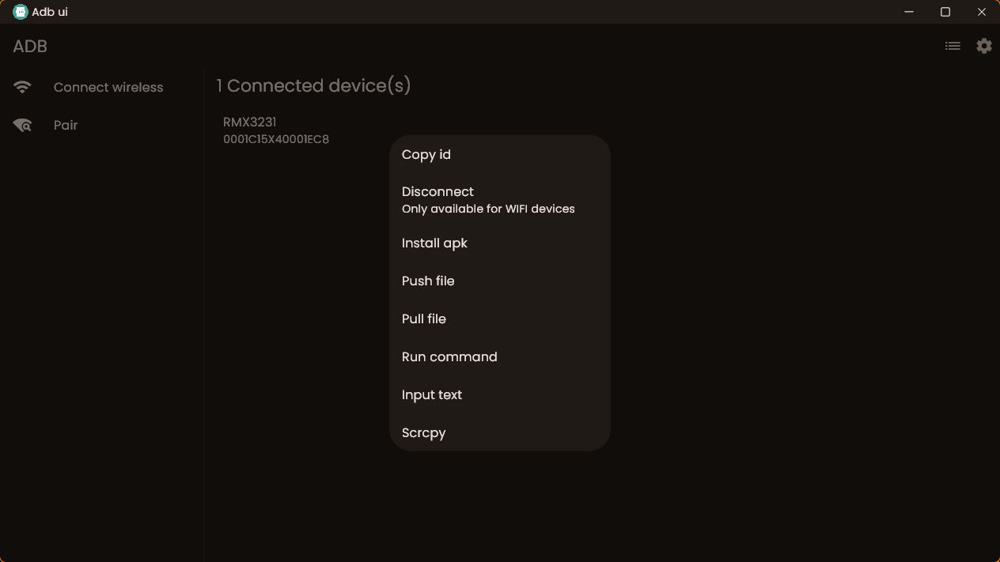
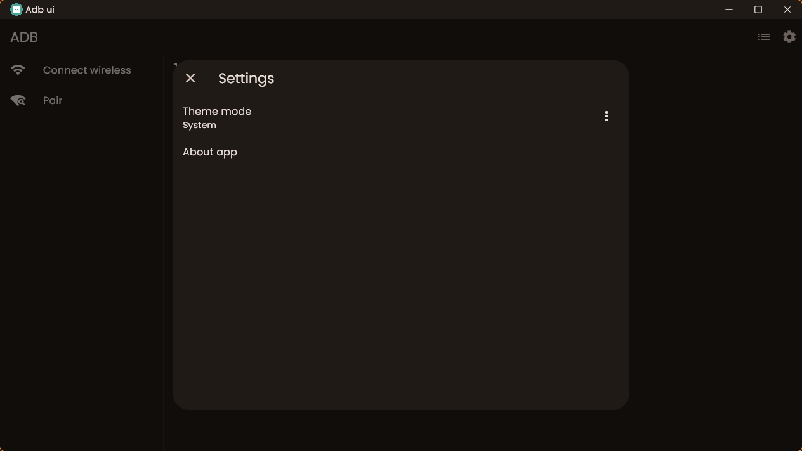

# ADB UI

This is a very simple app to easily run adb commands with a simple ui made with flutter. More features cooming soon.

Currently working features:

- Wifi connect/ disconnect.
- Install apk
- Push/Pull files.
- Command queue
- Open scrcpy.
- Rerun command from command quque.

## Screenshots

## Instalation

### Windows

There are 2 ways to install this.

1.  Setup installer(recomended way).
    - Find the latest release from https://github.com/IsmailAlamKhan/adb_ui/releases
    - Download the setup.
    - Follow the steps to install.
2.  Zip file.
    - Find the latest release from https://github.com/IsmailAlamKhan/adb_ui/releases
    - Download the zip file
    - Extract it.

### Mac os

- Find the latest release from https://github.com/IsmailAlamKhan/adb_ui/releases
- Download the dmg file
- Extract and run

### Linux

- Find the latest release from https://github.com/IsmailAlamKhan/adb_ui/releases
- Download the tar.gz file
- Extract and run
- (Optional) Open the adb-ui.desktop file provied in the tar.gz and replace `<Path to the instalation>` with something like `/home/ismail/Applications/adb-ui/` and then put that file to `~/.local/share/applications` to make this app available on "Show Applications"

## Contributers

Huge thanks goes to these people for helping me with this project, the ones who make the issues and feature requests and testing the app out and giving feedback.

### Special thanks to goes [@roipeker](!https://www.github.com/roipeker/) for running the app on mac os and helping me with the mac os build.
